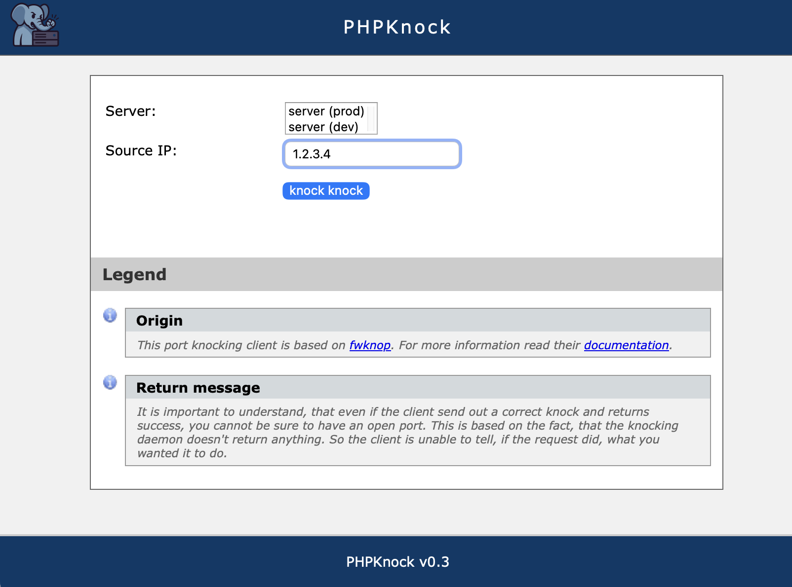

<p style="text-align:center;">
  
</p>

[](https://github.com/teqneers/phpknock/actions/workflows/ci.yml)
[](https://github.com/teqneers/phpknock/actions/workflows/docker.yml)
[](LICENSE)
[](https://www.php.net/)
[](https://ghcr.io/teqneers/phpknock)

**PHPKnock** is a web frontend for the port-knocking client [fwknop](https://cipherdyne.org/fwknop/). It lets you send a Single Packet Authorization (SPA) or port-knocking request to a remote server directly from a browser, without needing fwknop installed locally.

<p style="text-align:center;">
  
</p>

**Why a web frontend?** It lets you trigger port-knocking from any device with a browser. Typical use cases:

- Install it on an intranet server so staff can open ports on other servers in your network.
- Install it in your extranet so support staff can send SPA requests from home without installing fwknop on their own machines.

For background reading, see Wikipedia on [port knocking](https://en.wikipedia.org/wiki/Port_knocking) and [Single Packet Authorization](https://en.wikipedia.org/wiki/Single_Packet_Authorization).


Features
--------

- **Single Packet Authorization** via [fwknop](https://cipherdyne.org/fwknop/) — no fwknop installation required on the client device
- **Flexible destination configuration** — free-text input, a fixed server set in config, or a named dropdown list
- **Multi-host knocking** — knock multiple servers in one submit (semicolon-separated or dropdown multi-select)
- **CSRF protection** — synchronizer token validated on every form submission
- **Per-IP rate limiting** — configurable attempt limit and time window to prevent abuse
- **Destination validation** — user-supplied hosts are validated as a proper IP address or RFC 1123 hostname before being passed to fwknop
- **Audit log** — every knock attempt (timestamp, source IP, destination, success/fail) is recorded to `log/audit.log` by default
- **HMAC authentication** — optional HMAC key support for Rijndael mode with configurable digest algorithm
- **GPG encryption mode** — asymmetric encryption via GPG keys as an alternative to Rijndael
- **Encryption key handling** — key is written to a temp file (`chmod 0600`) and passed to fwknop via `-G`; never appears on the command line
- **Docker / FrankenPHP support** — zero-config container deployment; all settings via environment variables
- **No build tools or Composer required** for production — plain PHP, no framework


Requirements
------------

- PHP >= 8.1 (with `proc_open` enabled)
- fwknop client 2.x
- A web server (Apache, Nginx, etc.) **or** Docker
- Composer (for autoloading, traditional install only)


Installation
------------

### Option A — Docker (recommended)

#### Pre-built image

Pull the latest image from GitHub Container Registry:

```bash
docker pull ghcr.io/teqneers/phpknock:latest
docker run -p 80:80 -e PHPKNOCK_SERVER_PORT=62201 ghcr.io/teqneers/phpknock
```

#### Build from source

No config file is required. All settings are controlled via environment variables set in `docker/compose.yaml`.

1. Edit `docker/compose.yaml` and set the environment variables for your setup (see table below).

2. Start the container from the `docker/` directory:
   ```bash
   cd docker
   docker compose up -d
   ```

#### Environment variables

| Variable | Default | Description |
|---|---|---|
| `PHPKNOCK_SERVER_PORT` | `62201` | UDP port fwknopd listens on |
| `PHPKNOCK_ACCESS_PORT_LIST` | `tcp/22` | Ports to request access to (e.g. `tcp/22,udp/53`) |
| `PHPKNOCK_USE_HTTPS_ONLY` | `false` | Redirect HTTP → HTTPS |
| `PHPKNOCK_ENCRYPTION_KEY` | _(none)_ | Fixed encryption key; omit to let the user enter it in the browser |
| `PHPKNOCK_DESTINATION` | _(none)_ | Fixed destination IP/hostname, a semicolon-separated list for multiple hosts, or a JSON object (`{"10.0.0.1":"prod","10.0.0.2":"dev"}`) for a dropdown; omit to show a free-text input |
| `PHPKNOCK_ERRORS_VERBOSE` | `false` | Show fwknop command and raw output in the browser |
| `PHPKNOCK_ERRORS_LOG` | `/web/log/error.log` | Path to error log file |
| `PHPKNOCK_AUDIT_LOG` | `/web/log/audit.log` | Path to audit log file; set to empty string to disable |
| `PHPKNOCK_RATE_LIMIT` | `10` | Max knock attempts per IP per window (0 = disabled) |
| `PHPKNOCK_RATE_WINDOW` | `60` | Rate limit window in seconds |
| `PHPKNOCK_ENCRYPTION_MODE` | `rijndael` | `rijndael` (AES symmetric) or `gpg` (GPG asymmetric) |
| `PHPKNOCK_HMAC_ENABLED` | `false` | Enable HMAC authentication (Rijndael mode only) |
| `PHPKNOCK_HMAC_KEY` | _(none)_ | Fixed HMAC key; omit to let the user enter it in the browser |
| `PHPKNOCK_HMAC_DIGEST_TYPE` | `sha256` | HMAC digest algorithm: `md5`, `sha1`, `sha256`, `sha384`, `sha512` |
| `PHPKNOCK_GPG_RECIPIENT_KEY` | _(none)_ | Server's GPG key ID (required for GPG mode) |
| `PHPKNOCK_GPG_SIGNER_KEY` | _(none)_ | Client's GPG key ID (required for GPG mode) |
| `PHPKNOCK_GPG_HOME_DIR` | _(none)_ | GPG keyring path; omit to use system default |

### Option B — Traditional web server

1. Clone or download PHPKnock somewhere outside your document root, for example `/opt/phpknock`.

2. Point your web server at the `app/public/` subdirectory. Example Apache alias:
   ```apacheconf
   Alias /phpknock /opt/phpknock/app/public
   ```
   See [Apache mod_alias](https://httpd.apache.org/docs/2.4/mod/mod_alias.html#alias) for details.

3. Install dependencies:
   ```bash
   cd app
   composer install
   ```

4. Copy and configure the config file:
   ```bash
   cp app/local_config.php.dist app/local_config.php
   vi app/local_config.php
   ```

5. Make the `tmp/` and `log/` directories writable by the web server user:
   ```bash
   chown www-data:www-data tmp log
   chmod 770 tmp log
   ```

6. Open `https://your-domain.com/phpknock/` in a browser.


Development
-----------

### Docker Bake

The project uses [Docker Bake](https://docs.docker.com/build/bake/) to orchestrate image builds. The bake file is at `docker/docker-bake.hcl`. Run all commands from the `docker/` directory.

**Dev image** (no app code baked in — use with volume mounts for live editing):
```bash
docker buildx bake dev
```

**Production image** (app code and Composer dependencies baked in):
```bash
docker buildx bake
```

To override the image tag:
```bash
docker buildx bake --set 'default.tags=ghcr.io/teqneers/phpknock:0.3.0'
```

### Tests and static analysis

```bash
cd app
composer install
./vendor/bin/phpunit
./vendor/bin/phpstan analyse
```


Contribute
----------

Bug reports and pull requests are welcome via the [GitHub issue tracker](https://github.com/teqneers/phpknock/issues).


License
-------

Copyright (C) 2012-2026 by TEQneers GmbH & Co. KG

Permission is hereby granted, free of charge, to any person obtaining a copy of this software and associated documentation files (the "Software"), to deal with the Software without restriction, including without limitation the rights to use, copy, modify, merge, publish, distribute, sublicense, and/or sell copies of the Software, and to permit persons to whom the Software is furnished to do so, subject to the following conditions:

The above copyright notice and this permission notice shall be included in all copies or substantial portions of the Software.

THE SOFTWARE IS PROVIDED "AS IS", WITHOUT WARRANTY OF ANY KIND, EXPRESS OR IMPLIED, INCLUDING BUT NOT LIMITED TO THE WARRANTIES OF MERCHANTABILITY, FITNESS FOR A PARTICULAR PURPOSE AND NONINFRINGEMENT. IN NO EVENT SHALL THE AUTHORS OR COPYRIGHT HOLDERS BE LIABLE FOR ANY CLAIM, DAMAGES OR OTHER LIABILITY, WHETHER IN AN ACTION OF CONTRACT, TORT OR OTHERWISE, ARISING FROM, OUT OF OR IN CONNECTION WITH THE SOFTWARE OR THE USE OR OTHER DEALINGS IN THE SOFTWARE.
